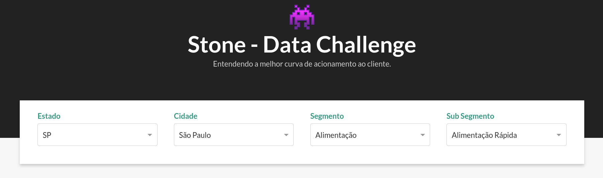

# Stone Data Challenge 2022

O Data Challenge da Stone é um desafio de dados com o objetivo de impulsionar o desenvolvimento de pessoas brilhantes através de uma experiência mão na massa.

O evento quer conectar profissionais e entusiastas do universo de dados e analytics, através da abordagem de problemas reais que você encontrará no meio corporativo, sendo também uma oportunidade de treinar e desafiar seus conhecimentos. E tudo isso concorrendo a prêmios incríveis!

## Estrutura do projeto

Como temos alguns diretórios no projeto, achei válido descrever aqui como as coisas estão separadas:

- `.github`: contém arquivos do CI (Continuous Integration) de deploy da documentação
- `dash`: contém os arquivos de configuração do dash
- `data`: vai ser criada após rodar o `Makefile` e serve para armazenar todo o dado utilizado no projeto
- `docs`: onde os arquivos `markdowns` são escritos, para posterior conversão no html da documentação
- `info`: coloquei arquivos que foram fornecidos pela Stone, que contém todo a explicação do case.
- `notebooks`: todos os notebooks realizados no projeto
- `site`: criado pelo `mkdocs`
- `src`: contém scripts que nos ajudam a separar melhor a lógica utilizada nos notebooks, como criação de features de alguns plots.

## Configurando o ambiente

Toda a configuração do ambiente foi automatizada por um `Makefile`. Dessa forma, a única coisa que você precisa é ter o `make` instalado na sua máquina. Se você usa Windows, pode utilizar o WSL e se utiliza linux, o `make` já vai estar instalado.

Segue um link que vai te ajudar a configurar o `make` no windows: [link](https://coffops.com/usando-comando-make-projetos-windows/)

Um outro pré-requesito, como o projeto utiliza `Poetry` como gerenciador de pacotes, é preciso que você tenha-o instalado no ambiente python atual, antes de emular o ambiente virtual (o `Makefile` vai fazer isso pra você).

1. `pip install poetry`
2. `make setup`

## Iniciando o dashboard

Como um dos notebooks faz uma série de tratamentos e limpeza nos dados, antes de rodar o dashboard, é preciso que execute o notebook `final_composition.ipynb`. O mesmo vai gerar um dataset dentro do diretório dados criado.

Agora, basta executar a linha de comando abaixo:

- `cd dash`
- `python app.py`

Pronto, se tudo correu bem, o dashboard vai estar online no localhost:8050, e terá uma interface como a seguinte imagem:

