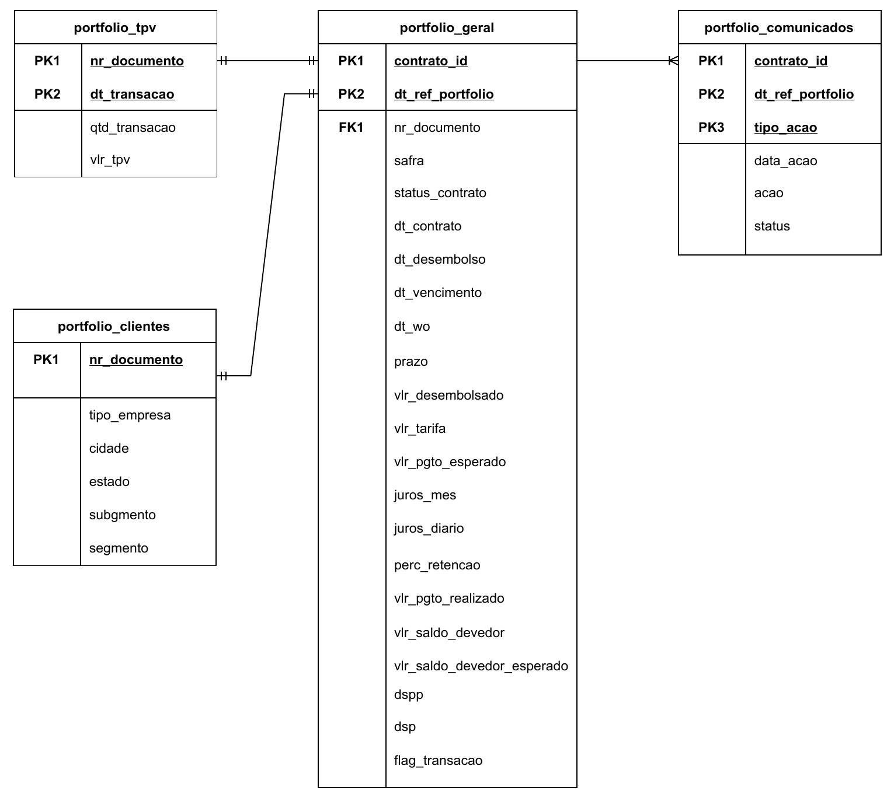

# Dicionário de Dados

Diagrama de Entidade-Relacionamento para demonstrar como as bases estão relacionadas.

## `portfolio_geral`

| Feature                    | Type           | Description                                                                                                                                                                                                                                                           |
| -------------------------- | -------------- | --------------------------------------------------------------------------------------------------------------------------------------------------------------------------------------------------------------------------------------------------------------------- |
| contrato_id                | string         | Identificador único do contrato de um cliente.                                                                                                                                                                                                                        |
| dt_ref_portfolio           | date           | Data de referência da base de portfolio, representa a qual data um determinado registro/linha corresponde.                                                                                                                                                            |
| safra                      | date           | Mês que o contrato foi originado (desembolsado).                                                                                                                                                                                                                      |
| nr_documento               | string         | Número do documento do cliente.                                                                                                                                                                                                                                       |
| status_contrato            | string         | Estado atual do empréstimo, podendo ser "Desembolso confirmado (DisbursementConfirmed), Aceito (Accepted), Desembolso solicitado (DisbursementRequested), Ativo (Active) ou Quitado (Settled)".                                                                       |
| dt_contrato                | date           | Data de criação do empréstimo.                                                                                                                                                                                                                                        |
| dt_desembolso              | date           | Data de desembolso do empréstimo, onde de fato liberamos o valor tomado na conta do cliente.                                                                                                                                                                          |
| dt_vencimento              | date           | Data de vencimento do contrato.                                                                                                                                                                                                                                       |
| dt_wo                      | date           | Data de write-off do contrato onde, caso o cliente não evolua com o pagamento, o contrato é declarado como perda.                                                                                                                                                     |
| prazo                      | bigint         | Prazo/parcelas do contrato da linha de crédito, geralmente o prazo médio é de 8 meses.                                                                                                                                                                                |
| vlr_desembolsado           | decimal (15,2) | Valor contratado no empréstimo.                                                                                                                                                                                                                                       |
| vlr_tarifa                 | decimal (15,2) | Tarifa de contratação (representa 1% do valor do empréstimo).                                                                                                                                                                                                         |
| vlr_pgto_esperado          | decimal (15,2) | Representa o valor de pagamento esperado de um contrato dado suas características. É resultado do cálculo (juros_diario + iof_diario, (dt_vencimento - dt_desembolso).days, vlr_desembolsado + vlr_tarifa + iof_inicial).                                             |
| juros_mes                  | decimal (15,2) | Taxa de juros ao mês (% am).                                                                                                                                                                                                                                          |
| juros_diario               | decimal (15,2) | Taxa de juros nominal do contrato representada por valor diário = (1 + juros_mes) ^ (1 / 30) - 1.                                                                                                                                                                     |
| perc_retencao              | decimal (15,2) | Percentual retido diariamente sobre as liquidações do cliente que será revertida no pagamento do contrato dia após dia (quando houver TPV).                                                                                                                           |
| vlr_pgto_realizado         | decimal (15,2) | Valor do pagamento diário contabilizado de um cliente.                                                                                                                                                                                                                |
| vlr_saldo_devedor          | decimal (15,2) | Valor devedor atualizado atual do contrato, considerando pagamentos, acúmulo de juros e encargos do mesmo.                                                                                                                                                            |
| vlr_saldo_devedor_esperado | decimal (15,2) | Valor devedor esperado do contrato dado o ritmo de pagamento previsto para o mesmo, considerando pagamentos, acumulo de juros e encargos do mesmo.                                                                                                                    |
| dspp                       | bigint         | Contagem de dias consecutivos sem amortização do saldo principal. A contagem é sempre zero quando há amortização do principal. Então se um cliente esta há 50 dias sem amortizar o mínimo e no dia seguinte amortiza o principal (qualquer valor), a contagem reseta. |
| dsp                        | bigint         | Contagem de dias consecutivos sem qualquer pagamento realizado.                                                                                                                                                                                                       |
| flag_transacao             | int            | Flag indicado se, na data de referência, houve algum valor transacionado na maquininha do cliente (TPV).                                                                                                                                                              |

## `portfolio_tpv`

| Features       | Type   | Description                                                                                           |
| -------------- | ------ | ----------------------------------------------------------------------------------------------------- |
| nr_documento   | string | Número do documento do cliente.                                                                       |
| dt_transacao   | string | Campo que indica a data que houve algum valor transacionado na maquininha do cliente.                 |
| qtd_transacoes | bigint | Campo que indica a quantidade de transações registradas na maquininha do cliente em determinada data. |
| vlr_tpv        | double | Este campo se refere ao valor total transacionado na maquininha do cliente.                           |

## `portfolio_comunicados`

| Features         | Type   | Description                                                                                                                                                                |
| ---------------- | ------ | -------------------------------------------------------------------------------------------------------------------------------------------------------------------------- |
| contrato_id      | string | Identificador único do contrato de um cliente.                                                                                                                             |
| dt_ref_portfolio | date   | Data de referência da base de portfolio, representa a qual data um determinado registro/linha corresponde.                                                                 |
| data_acao        | date   | A data que uma ação de comunicação foi executada e enviada para o cliente.                                                                                                 |
| tipo_acao        | string | Qual é o tipo da ação de comunicação executada.                                                                                                                            |
| acao             | string | Tipo da ação de comunicação utilizada pelo time de cobrança para identificar qual foi a campanha executada. Representa em qual momento da régua determinado contrato esta. |
| status           | string | Status atualizado da comunicação enviada, podendo ser 'Enviado', 'Não entregue', 'Lido', 'Respondido'.                                                                     |

## `portfolio_clientes`

| Features     | Type   | Description                                                             |
| ------------ | ------ | ----------------------------------------------------------------------- |
| nr_documento | string | Número do documento do cliente.                                         |
| tipo_empresa | string | Representa o tipo de empresa que corresponde do cliente MEI, CPF, CNPJ. |
| cidade       | string | Cidade de origem do cliente que contratou o produto de crédito.         |
| estado       | string | Estado de origem (UF) do cliente que contratou o produto de crédito.    |
| subsegmento  | string | Micro segmento de negócio em que o cliente está inserido.               |
| segmento     | string | Macro segmento de negócio em que o cliente está inserido.               |
