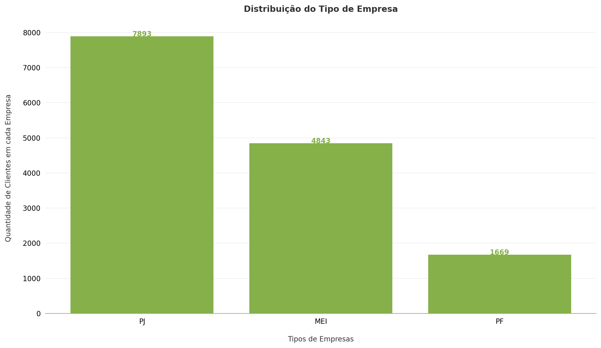
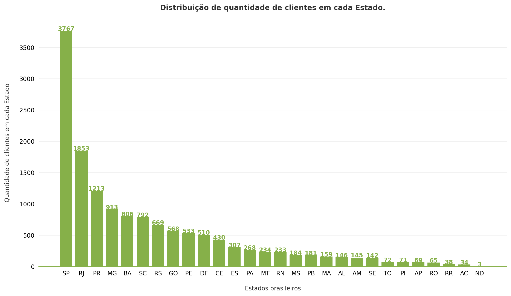
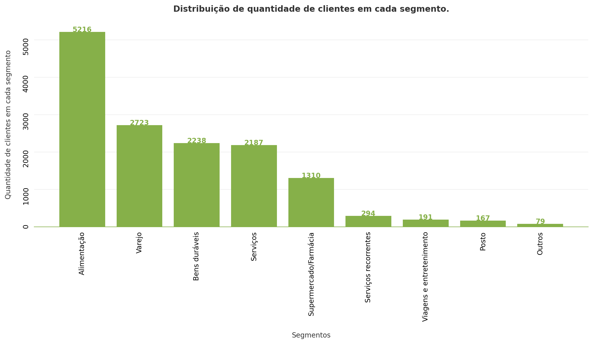
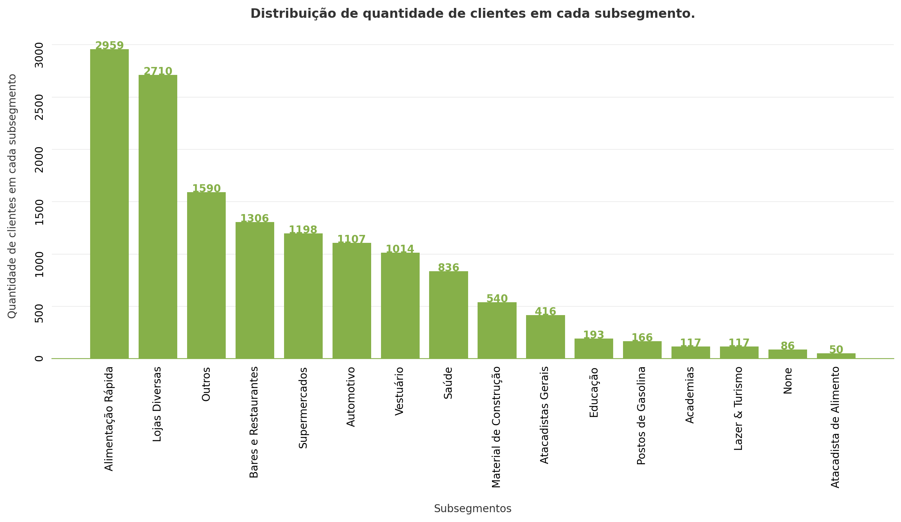
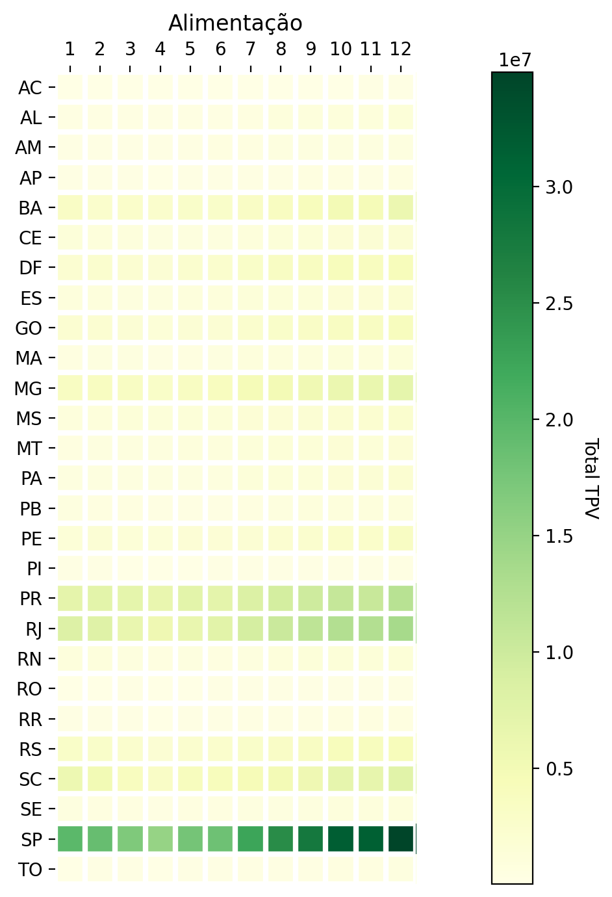
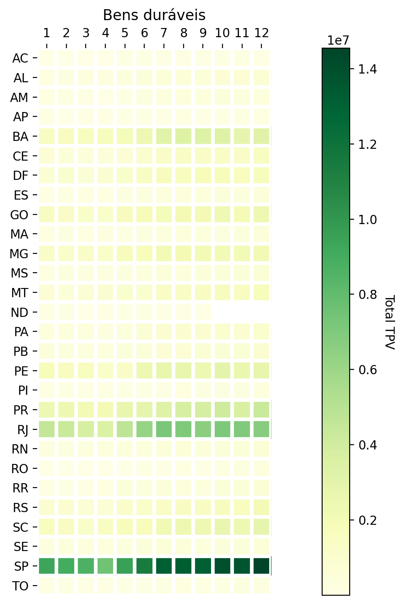
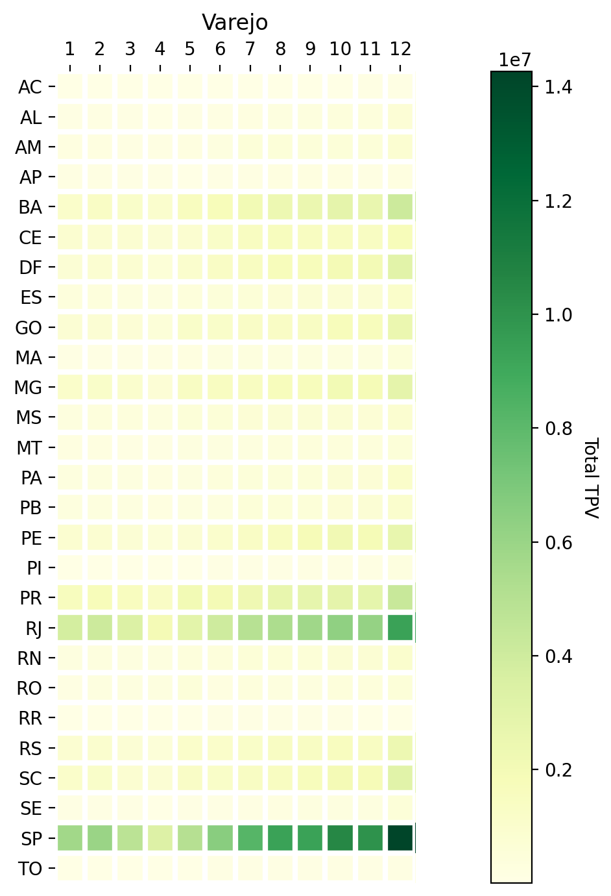
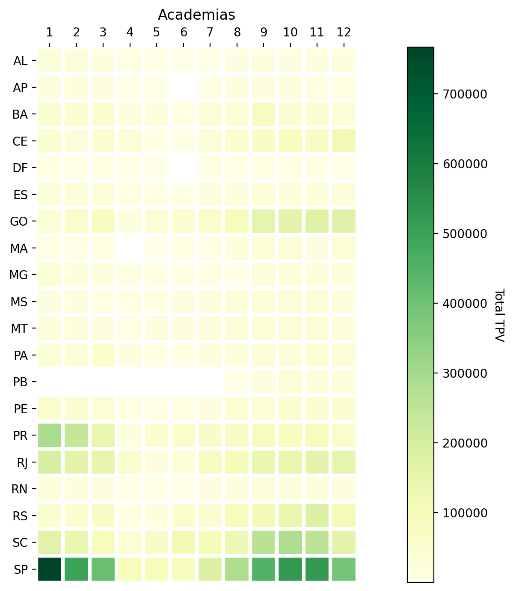
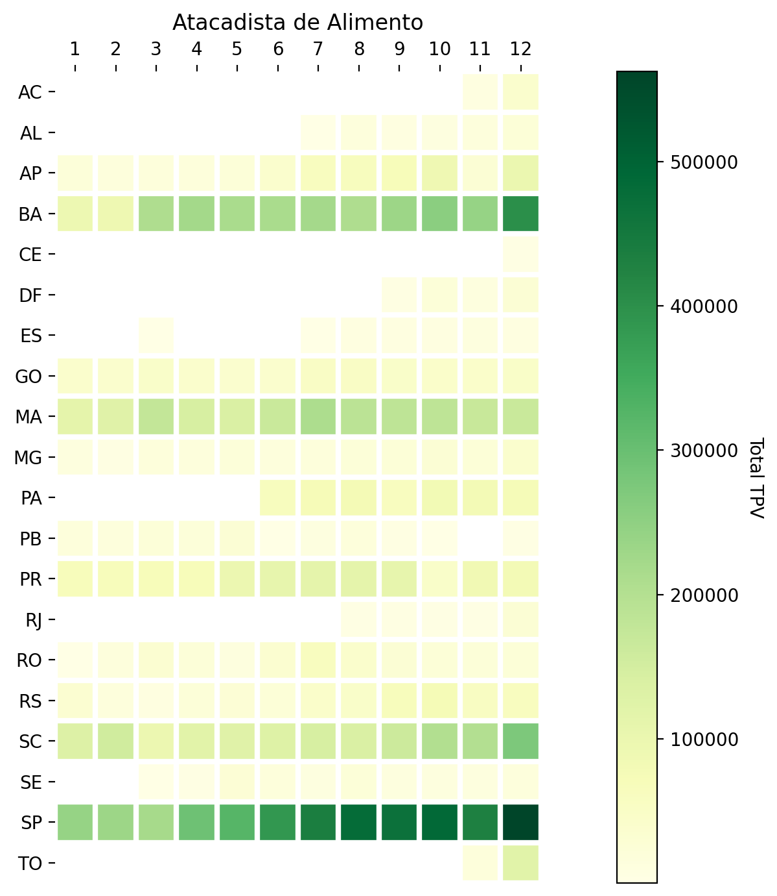

# Data Challenge Stone 2022


O objetivo dessa página é servir de documnetação de todo o processo de análise realizado na base fornecida pela Stone. Aqui será registrado o Framework de Avaliação que foi solicitado pela Stone.

Para mais informações sobre o desafio acesse: [LINK](https://lp.stone.com.br/stone-data-challenge/).

## Framework de Avaliação

A minha análise sobre os dados da Stone segue _duas grandes etapas_. Primeiramente foi realizado uma análise mais descritiva dos dados, com o objetivo de conhecer detalhes dos dados e possíveis inconsistências. E posteriormente, uma análise mais direcionada para resolução do problema.

Nas **validações iniciais** será registrado a etapa descritiva, e em **fluxo de etapas realizadas** será registrado os passos para chegar na melhor curva de acionamento do cliente.

### Validações iniciais

Como dito anteriormente, nesta etapa foi realizada uma análise descritiva das bases que estão disponíveis para trabalhar. Nesse caso nós tempos:

- portfolio_clientes
- portfolio_comunicados
- portfolio_geral
- portfolio_tpv

```python
# libs
import pandas as pd
import numpy as np
import matplotlib.pyplot as plt
from src.make_plot import plot

# matplotlib configs
plt.rcParams["figure.figsize"] = (12, 7)
plt.rcParams["figure.dpi"] = 200

# data
clients = pd.read_csv("data/portfolio_clientes.csv")
tpv = pd.read_csv("data/portfolio_tpv.csv")
comunicados = pd.read_csv("data/portfolio_comunicados.csv")
geral = pd.read_csv("data/portfolio_geral.csv")
```

#### 1. portfolio_clientes

Aqui encontramos todas as informações relacionadas aos dados cadastrais dos clientes que contratam empréstimos, assim como dados geográficos e segmentos do negócio.

A base deveria possuir como registro único, a coluna de `nr_documento`, porém foi visto que existem registros duplicados. Devido a essa inconsistência, os contratos relacionadas aos `nr_documento` duplicados não serão considerados.

Vamos então calcular o total de clientes registrados:

```python
# total de clientes
clients_wo_duplicate = clients.drop_duplicates(["nr_documento"])
clients_wo_duplicate.shape
```

```bash
(14265, 6)
```

Dessa forma, possuímos um total de **14.265 clientes** na base. Esse valor não reflete diretamente na quantidade de contrato já que cada cliente pode possuir mais de um contrato. Apenas a nível já realizarmos um comparativo, puxamos também o número de contratos registrados na base:

```python
# total de clientes
geral.drop_duplicates("contrato_id").shape
```

```bash
(14756, 22)
```

Trazendo a informação da tabela `portfolio_geral` vemos que existe um número levemente maior, **14.756 contratos**, registrados.

Essa base é composta de mais algumas variáveis categóricas, e saber como as mesmas estão distribuídas pode nos trazer bons insights para análises futuras mais complexas.

##### Distribuição de Tipo da Empresa

```python
# getthering the data to plot
counts = clients.value_counts("tipo_empresa").reset_index()
y = counts[0].values
x = counts["tipo_empresa"].values

# this function is part of the code on src directory
plot.make_beautiful_bar_plots(
    x,
    y,
    "Distribuição do Tipo de Empresa",
    "Tipos de Empresas",
    "Quantidade de Clientes em cada Empresa",
    False
)
```



A maioria dos clientes estão cadastrados como **Pessoa Jurídica**, e bem pouco como **Pessoal Física**.

##### Distribuição dos Estados

```python
counts = clients.value_counts("estado").reset_index()
y = counts[0].values
x = counts["estado"].values

# this function is part of the code on src directory
plot.make_beautiful_bar_plots(
    x,
    y,
    "Distribuição de quantidade de clientes em cada Estado.",
    "Estados brasileiros",
    "Quantidade de clientes em cada Estado",
    False
)
```



Aqui vemos uma grande maioria dos clientes pertecentes ao Estado de **São Paulo**, seguido pelo **Rio de Janeiro**. A diferença dentre os outros Estados vai decaindo gradualmente.

##### Distribuição dos Segmentos e Subsegmentos

```python
counts = clients.value_counts("segmento").reset_index()
y = counts[0].values
x = counts["segmento"].values

# this function is part of the code on src directory
plot.make_beautiful_bar_plots(
    x,
    y,
    "Distribuição de quantidade de clientes em cada segmento.",
    "Segmentos",
    "Quantidade de clientes em cada segmento",
    True
)
```



Quando olhamos para os segmentos, é possível ver uma predominância do setor de _Alimentação_, seguido de _Verejo_, _Bens Duráveis_, _Serviços_ e _Supermercado/Farmácia_, com uma minoria em outras 4 categorias.

```python
counts = clients.value_counts("subsegmento").reset_index()
y = counts[0].values
x = counts["subsegmento"].values

# this function is part of the code on src directory
plot.make_beautiful_bar_plots(
    x,
    y,
    "Distribuição de quantidade de clientes em cada subsegmento.",
    "Subsegmentos",
    "Quantidade de clientes em cada subsegmento",
    True
)
```



Já nos Subsegmentos, temos duas grandes representatividades, Alimentação Rápida e Lojas Diversas. De _Outros_ em diante, a frequência de clientes vai caindo gradualmente.

Um ponto interessante a se observar é que a maior quantidade de clientes está relacionada a _Alimentação_, seja diretamente, como indiretamente dentro dos top 5, como: Bares e Restaurantes e Supermercados.

Interessante a se notar também é que temos a presença de um subsegmento chamado `None` como uma string válida, quando na verdade categoriza um missing value e não um subsegmento de fato.

#### 2. portfolio_tpv

Essa tabela trás toda a informação de _Total Paid Value_ que representa o valor transacionado no dia por cada um dos clientes pela maquininha Stone.

Aqui buscou-se também pela contagem de quantos `nr_documento` existem na tabela, chegando no valor de **14.259 clientes**.

```py
tpv.drop_duplicates("nr_documento").shape
```

```bash
(14259, 4)
```

Veja que aqui nós temos uma divergência em relação à quantidade de `nr_documento` presente na tabela `portfolio_geral`. Um total de 6 clientes não possuem registro de TPV, porém, quando analisados na `portfolio_geral` vemos que os mesmos possuem valor de pagamento realizado, caracterizados pela presença de média.

```py
nr_documento_tpv = tpv.drop_duplicates("nr_documento")["nr_documento"].to_list()
geral_for_not_tpv = geral[~geral["nr_documento"].isin(nr_documento_tpv)]
geral_for_not_tpv[["vlr_desembolsado", "vlr_pgto_realizado"]].describe()
```

| stats | vlr_desembolsado | vlr_pgto_realizado |
| :---: | :--------------: | :----------------: |
| count |     3938.00      |      3938.00       |
| mean  |     11854.92     |       11.86        |
|  std  |     7246.29      |       176.45       |
|  min  |      384.75      |        0.00        |
|  25%  |     3078.00      |        0.00        |
|  50%  |     17100.00     |        0.00        |
|  75%  |     17100.00     |        0.00        |
|  max  |     20520.00     |      5969.64       |

Olhando um pouco mais no detalhe, é possível ver que alguns dos clientes de fato não tiveram nenhum pagamento realizado, o que justifica o mesmo não possuir registro na tabela `portfolio_tpv`.

```py
geral_for_not_tpv.groupby(["nr_documento"])["vlr_pgto_realizado"].agg(["mean"])
```

|           nr_documento           |   mean    |
| :------------------------------: | :-------: |
| 0a6b34a6b108015777d83b1023d43342 | 23.359794 |
| 1eb088b95b56970c880030922dce1c85 | 17.530547 |
| 69116fe5b82f759fd2f295f1daa92ecf | 0.000000  |
| 6ef839f0201c6295072e45a95eb34466 | 10.529941 |
| e6addfdeb74a038bb5f7149c7cfb1290 | 17.557847 |
| ec55907309c0e6195675cb786f7d7242 | 0.000000  |

Analisar o TPV como um todo não é muito conclusivo, temos valores muito dispersos de valor transacionado diariamente, assim como de máximos e mínimos.

```py
tpv[["qtd_transacoes", "vlr_tpv"]].describe().apply(lambda s: s.apply("{0:.5f}".format))
```

| stats | dt_transacao | qtd_transacoes |  vlr_tpv   |
| :---: | :----------: | :------------: | :--------: |
| count |  4408597.00  |   4408597.00   | 4408597.00 |
| mean  | 20204274.56  |     15.91      |   887.50   |
|  std  |   4656.32    |     26.15      |  1664.21   |
|  min  | 20200101.00  |     -2.00      | -125000.00 |
|  25%  | 20200624.00  |      3.00      |   175.00   |
|  50%  | 20201030.00  |      7.00      |   430.00   |
|  75%  | 20210226.00  |     18.00      |   978.00   |
|  max  | 20210630.00  |    1245.00     | 176880.93  |

Portanto, como temos os dados cadastrais dos clientes, é mais interessante levar isso em consideração na hora fazer a análise.

Vamos primeiramente juntar as bases:

```py
tpv_merged = tpv.merge(right=clients, on="nr_documento", how="inner")
```

Analisando primeiramente o TPV para segmento e subsegmento, temos:

```py
tpv_sum_segment = tpv_merged.groupby(["segmento"])["vlr_tpv"].agg(["sum"]).reset_index()
tpv_sum_segment["prop"] = tpv_sum_segment["sum"] / tpv_sum_segment["sum"].sum()

tpv_sum_subsegment = tpv_merged.groupby(["subsegmento"])["vlr_tpv"].agg(["sum"]).reset_index()
tpv_sum_subsegment["prop"] = tpv_sum_subsegment["sum"] / tpv_sum_subsegment["sum"].sum()

tpv_sum_segment.sort_values("prop", ascending=False)
```

|         segmento         |     sum      |   prop   |
| :----------------------: | :----------: | :------: |
|       Alimentação        | 1.473060e+09 | 0.372553 |
|      Bens duráveis       | 7.342777e+08 | 0.185707 |
|          Varejo          | 5.917481e+08 | 0.149660 |
|  Supermercado/Farmácia   | 4.799287e+08 | 0.121379 |
|         Serviços         | 4.409396e+08 | 0.111518 |
|          Posto           | 8.120651e+07 | 0.020538 |
|   Serviços recorrentes   | 6.621661e+07 | 0.016747 |
| Viagens e entretenimento | 4.964331e+07 | 0.012555 |
|          Outros          | 3.694166e+07 | 0.009343 |

Aqui vemos que a ordem muda um pouco, onde **Varejo perde posição para Bens Duráveis** e **Serviços para Supermercado/Farmácia**

```py
tpv_sum_subsegment.sort_values("prop", ascending=False)
```

|      subsegmento       |     sum      |   prop   |
| :--------------------: | :----------: | :------: |
|   Alimentação Rápida   | 7.782735e+08 | 0.196834 |
|     Lojas Diversas     | 6.846034e+08 | 0.173144 |
|     Supermercados      | 4.372940e+08 | 0.110596 |
|  Bares e Restaurantes  | 3.662225e+08 | 0.092622 |
|         Outros         | 3.469090e+08 | 0.087737 |
|       Automotivo       | 2.711954e+08 | 0.068588 |
|         Saúde          | 2.537558e+08 | 0.064178 |
| Material de Construção | 2.178250e+08 | 0.055090 |
|       Vestuário        | 2.070685e+08 | 0.052370 |
|   Atacadistas Gerais   | 1.396476e+08 | 0.035318 |
|   Postos de Gasolina   | 8.112604e+07 | 0.020518 |
|        Educação        | 4.507371e+07 | 0.011400 |
|          None          | 4.076986e+07 | 0.010311 |
|    Lazer & Turismo     | 3.600002e+07 | 0.009105 |
| Atacadista de Alimento | 2.495160e+07 | 0.006311 |
|       Academias        | 2.324615e+07 | 0.005879 |

Em relação ao subsegmento, vemos que houve uma troca de posição entre **Supermercados e Outros**.

Com essas duas bases podemos buscar por sasonalidade nos dados e melhor compreender como cada negócio oscila ao passar do tempo. Para isso, iremos utilizar uma visão de heatmap variando na horizontal o meses do ano, e na vertical todos os nossos Estados, e o valor mapeado no heatmap é o somatório do TPV naquele específico grupo.

Vamos criar as variáveis temporais que iremos precisar e agroupar os dados que serão utilizados para o heatmap:

```py
tpv_merged["dt_transacao"] = pd.to_datetime(tpv_merged["dt_transacao"], format="%Y%m%d")
tpv_merged["month"] = tpv_merged["dt_transacao"].dt.month
tpv_merged["year"] = tpv_merged["dt_transacao"].dt.year

# grouping
df = (
    tpv_merged.groupby(["segmento", "estado", "year", "month"])["vlr_tpv"]
    .agg(["sum"])
    .reset_index()
)

# labels for the plot
segmentos = list(df["segmento"].unique())
monhts = [1, 2, 3, 4, 5, 6, 7, 8, 9, 10, 11, 12]

# this code will generate all heatmaps
for segmento in segmentos:
    df_segmento = df[(df["year"] == 2020) & (df["segmento"] == segmento)]
    estados = list(df_segmento["estado"].unique())

    df_heatmap = df_segmento.drop(["segmento"], axis=1).pivot_table(
        values="sum", index=["estado"], columns=["month"]
    )


    fig, ax = plt.subplots()

    im, cbar = plot.heatmap(df_heatmap, estados, monhts, ax=ax,
                    cmap="YlGn", cbarlabel="Total TPV")

    # Number of accent colors in the color scheme
    plt.title(segmento)
    fig.tight_layout()
    plt.show()

```

Como temos diferentes tipos de segmentos, achei mais prudente trazer apenas os Top 3 segmentos de maior TPV para interpretarmos os heatmaps.







O que vemos aqui é que o valor do total de TPV transacionado ao longo do ano de 2020 foram bem semelhantes, com predomínio de São Paulo e Rio de Janeiro (por serem os Estados com mais clientes) e a predominância também do período do segundo trimestre ter sido um período de baixa e que provavelmente deve ter impactado o valor pago nas maquininhas.

O Subsegmento também demonstrou comportamento semelhante ao considerar os Top 3 pelo valor do TPV. A única diferença é que acabamos tendo uma variabilidade maior entre os Estados e ao longo do ano para subsegmentos menores, como **Academia e Atacadista de Alimento**.





Acredito que tal comportamento deveria ser levado em consideração ao estabelecer uma régua de acionamento. Pois até mesmo, as cidades dentro de Estados maiores, como São Paulo e Rio de Janeiro também podem apresentar realidades diferentes por Segmentos e Subsegmentos.

#### 3. portfolio_comunicados

Essa tabela possui todo o dado de quem foi acionado no seu histórico de empréstimo de linha de crédito. Ao longo desse período, 403.704 acionamentos foram realizados, onde 47.35% sofreram algum problema e acabaram por não serem entregues, 34% foram de fato entregues, 17.6 foram lidas e 0.08 foram respondidas.

```py
comunicados.value_counts("status", normalize=True)
```

Também observou-se que os acionamentos são realizados por dois canais, **mensagens diretas e email**. Porém, ao analisar os subtotais dentro de cada status, vemos que não existe preferência entre os tipos canais utilizados

```py
comunicados.value_counts(["status", "tipo_acao"], normalize=True).reset_index()
```

|    status    | tipo_acao |     prop     |
| :----------: | :-------: | :----------: |
| NAO ENTREGUE |    HSM    |   0.236836   |
| NAO ENTREGUE |   EMAIL   |   0.236754   |
|   ENTREGUE   |    HSM    |   0.171046   |
|   ENTREGUE   |   EMAIL   |   0.170637   |
|     LIDO     |    HSM    | **0.088706** |
|     LIDO     |   EMAIL   | **0.088091** |
|  RESPONDIDO  |   EMAIL   |   0.004518   |
|  RESPONDIDO  |    HSM    |   0.003413   |

Todos esses acionamentos foram realizados para um total de **12.202 contratos**, o que representa aproximadamente **83% da base**. Um número bastante alto de clientes que apresentaram algum tipo de inadiplência.

E por fim, pelo gráfico abaixo, podemos ver que **52%** das campanhas realizadas foram de _observação_, seguido de parcelamento e boleto quitado.

```py
counts = comunicados.value_counts("acao").reset_index()

y = counts[0].values
x = counts["acao"].values

plot.make_beautiful_bar_plots(
    x,
    y,
    "Distribuição do Tipo de Ação",
    "Tipos de Ações",
    "Quantidade de Ações realizadas",
    False
)

```


#### portfolio_geral

Essa é a maior tabela que temos e a mesma tem todo o histórico de cada um dos mais de 12k de contratos registrados. Com ele nós temos as métricas de dsp e dspp, assim como detalhes de juros, valor de pagamento e outros dados que irão nos ajudar a correlaciona-la com as outras tabelas.

Como essa tabela vai passar por algumas transformações para indicar a melhor curva de acionamento na base, irei particionar a análise dela depois.

### Fluxo de etapas realizadas

Vamos focar inicialmente nas tabelas de `portfolio_geral` e `portfolio_comunicados` para separar a base entre contratos que receberam notificação, e contratos que não receberam nenhum comunicado durante o período de quitação da linha de crédito.

#### 1. Tratamento Qualquer

#### 2. Cruzamento nos dados

#### 3. Limpeza

#### 4. Criação de novas features

- prop_success_dsp: proporção de sucesso das comunicações que fora enviadas, dividida por cada tipo de acionamento dado.
- total_ideal_dsp: total de vezes que a msg deveria ser enviada ao cliente, por tipo de acionamento.
- mesma variável de cima, mas por dspp.
- valor total do crédito
- todos os dados sobre os clientes
- score_success_dsp
- score_success_dspp
- qtd de entregues, n-entregues e lidas por tipo de acionamento e por tipo de mensagem.

### Conclusões e Insights
