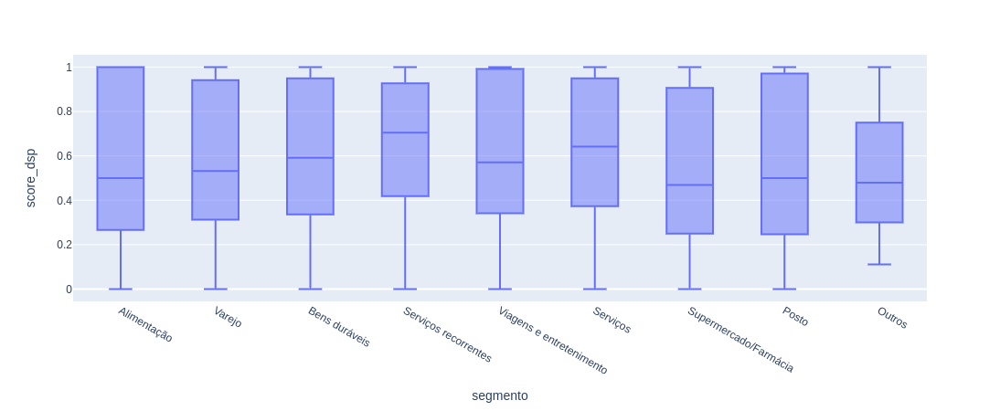
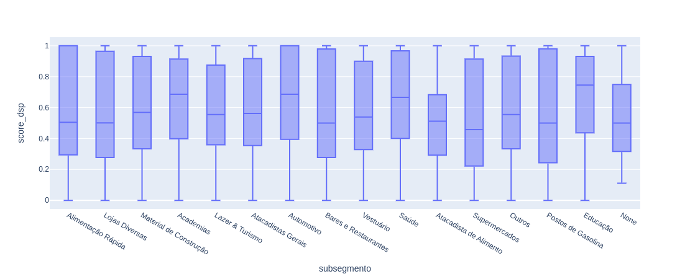
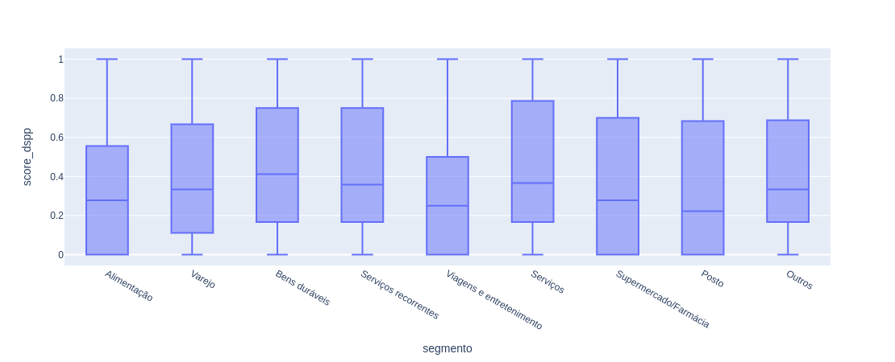
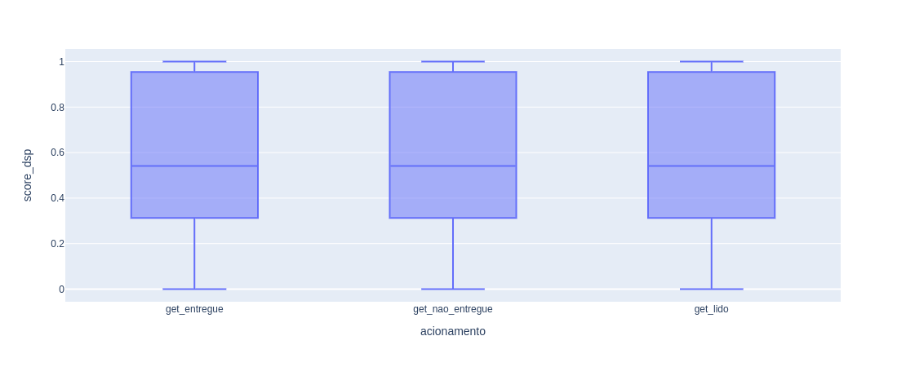
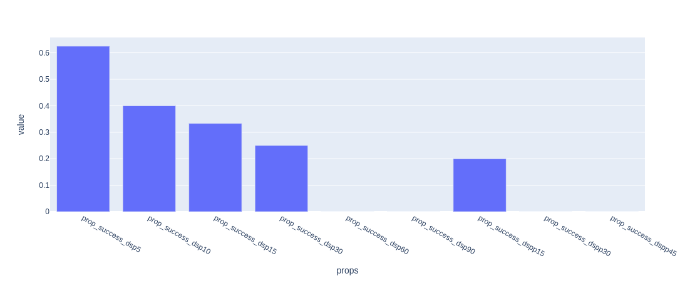

# Data Challenge Stone 2022


O objetivo dessa página é servir de documnetação de todo o processo de análise realizado na base fornecida pela Stone. Aqui será registrado o Framework de Avaliação.

Para mais informações sobre o desafio acesse: [LINK](https://lp.stone.com.br/stone-data-challenge/).

## Framework de Avaliação

A minha análise sobre os dados da Stone segue _duas grandes etapas_. Primeiramente foi realizado uma análise mais descritiva dos dados, com o objetivo de conhecer detalhes dos dados e possíveis inconsistências. E posteriormente, uma análise mais direcionada para resolução do problema.

Nas **validações iniciais** será registrado a etapa descritiva, e em **fluxo de etapas realizadas** será registrado os passos para chegar na melhor curva de acionamento do cliente.

### Validações iniciais

Como dito anteriormente, nesta etapa foi realizada uma análise descritiva das bases que estão disponíveis para trabalhar. Nesse caso nós tempos:

- `portfolio_clientes`
- `portfolio_comunicados`
- `portfolio_geral`
- `portfolio_tpv`

```python
# libs
import pandas as pd
import numpy as np
import matplotlib.pyplot as plt
from src.make_plot import plot

# matplotlib configs
plt.rcParams["figure.figsize"] = (12, 7)
plt.rcParams["figure.dpi"] = 200

# data
clients = pd.read_csv("data/portfolio_clientes.csv")
tpv = pd.read_csv("data/portfolio_tpv.csv")
comunicados = pd.read_csv("data/portfolio_comunicados.csv")
geral = pd.read_csv("data/portfolio_geral.csv")
```

#### 1. portfolio_clientes

Aqui encontramos todas as informações relacionadas aos dados cadastrais dos clientes que contratam empréstimos, assim como dados geográficos e segmentos do negócio.

A base deveria possuir como registro único, a coluna de `nr_documento`, porém foi visto que existem registros duplicados. Devido a essa inconsistência, os contratos relacionadas aos `nr_documento` duplicados não serão considerados.

Vamos então calcular o total de clientes registrados:

```python
# total de clientes
clients_wo_duplicate = clients.drop_duplicates(["nr_documento"])
clients_wo_duplicate.shape
```

```bash
(14265, 6)
```

Dessa forma, possuímos um total de **14.265 clientes** na base. Esse valor não reflete diretamente na quantidade de contrato já que cada cliente pode possuir mais de um contrato. Apenas a nível já realizarmos um comparativo, puxamos também o número de contratos registrados na base:

```python
# total de clientes
geral.drop_duplicates("contrato_id").shape
```

```bash
(14756, 22)
```

Trazendo a informação da tabela `portfolio_geral` vemos que existe um número levemente maior, **14.756 contratos**, registrados.

Essa base é composta de mais algumas variáveis categóricas, e saber como as mesmas estão distribuídas pode nos trazer bons insights para análises futuras mais complexas.

##### Distribuição de Tipo da Empresa

```python
# getthering the data to plot
counts = clients.value_counts("tipo_empresa").reset_index()
y = counts[0].values
x = counts["tipo_empresa"].values

# this function is part of the code on src directory
plot.make_beautiful_bar_plots(
    x,
    y,
    "Distribuição do Tipo de Empresa",
    "Tipos de Empresas",
    "Quantidade de Clientes em cada Empresa",
    False
)
```


A maioria dos clientes estão cadastrados como **Pessoa Jurídica**, e bem pouco como **Pessoal Física**.

##### Distribuição dos Estados

```python
counts = clients.value_counts("estado").reset_index()
y = counts[0].values
x = counts["estado"].values

# this function is part of the code on src directory
plot.make_beautiful_bar_plots(
    x,
    y,
    "Distribuição de quantidade de clientes em cada Estado.",
    "Estados brasileiros",
    "Quantidade de clientes em cada Estado",
    False
)
```


Aqui vemos uma grande maioria dos clientes pertecentes ao Estado de **São Paulo**, seguido pelo **Rio de Janeiro**. A diferença dentre os outros Estados vai decaindo gradualmente.

##### Distribuição dos Segmentos e Subsegmentos

```python
counts = clients.value_counts("segmento").reset_index()
y = counts[0].values
x = counts["segmento"].values

# this function is part of the code on src directory
plot.make_beautiful_bar_plots(
    x,
    y,
    "Distribuição de quantidade de clientes em cada segmento.",
    "Segmentos",
    "Quantidade de clientes em cada segmento",
    True
)
```


Quando olhamos para os segmentos, é possível ver uma predominância do setor de _Alimentação_, seguido de _Verejo_, _Bens Duráveis_, _Serviços_ e _Supermercado/Farmácia_, com uma minoria em outras 4 categorias.

```python
counts = clients.value_counts("subsegmento").reset_index()
y = counts[0].values
x = counts["subsegmento"].values

# this function is part of the code on src directory
plot.make_beautiful_bar_plots(
    x,
    y,
    "Distribuição de quantidade de clientes em cada subsegmento.",
    "Subsegmentos",
    "Quantidade de clientes em cada subsegmento",
    True
)
```


Já nos Subsegmentos, temos duas grandes representatividades, Alimentação Rápida e Lojas Diversas. De _Outros_ em diante, a frequência de clientes vai caindo gradualmente.

Um ponto interessante a se observar é que a maior quantidade de clientes está relacionada a _Alimentação_, seja diretamente, como indiretamente dentro dos top 5, como: Bares e Restaurantes e Supermercados.

Interessante a se notar também é que temos a presença de um subsegmento chamado `None` como uma string válida, quando na verdade categoriza um missing value e não um subsegmento de fato.

#### 2. portfolio_tpv

Essa tabela trás toda a informação de _Total Paid Value_ que representa o valor transacionado no dia por cada um dos clientes pela maquininha Stone.

Aqui buscou-se também pela contagem de quantos `nr_documento` existem na tabela, chegando no valor de **14.259 clientes**.

```py
tpv.drop_duplicates("nr_documento").shape
```

```bash
(14259, 4)
```

Veja que aqui nós temos uma divergência em relação à quantidade de `nr_documento` presente na tabela `portfolio_geral`. Um total de 6 clientes não possuem registro de TPV, porém, quando analisados na `portfolio_geral` vemos que os mesmos possuem valor de pagamento realizado, caracterizados pela presença de média.

```py
nr_documento_tpv = tpv.drop_duplicates("nr_documento")["nr_documento"].to_list()
geral_for_not_tpv = geral[~geral["nr_documento"].isin(nr_documento_tpv)]
geral_for_not_tpv[["vlr_desembolsado", "vlr_pgto_realizado"]].describe()
```

| stats | vlr_desembolsado | vlr_pgto_realizado |
| :---: | :--------------: | :----------------: |
| count |     3938.00      |      3938.00       |
| mean  |     11854.92     |       11.86        |
|  std  |     7246.29      |       176.45       |
|  min  |      384.75      |        0.00        |
|  25%  |     3078.00      |        0.00        |
|  50%  |     17100.00     |        0.00        |
|  75%  |     17100.00     |        0.00        |
|  max  |     20520.00     |      5969.64       |

Olhando um pouco mais no detalhe, é possível ver que alguns dos clientes de fato não tiveram nenhum pagamento realizado, o que justifica o mesmo não possuir registro na tabela `portfolio_tpv`.

```py
geral_for_not_tpv.groupby(["nr_documento"])["vlr_pgto_realizado"].agg(["mean"])
```

|           nr_documento           |   mean    |
| :------------------------------: | :-------: |
| 0a6b34a6b108015777d83b1023d43342 | 23.359794 |
| 1eb088b95b56970c880030922dce1c85 | 17.530547 |
| 69116fe5b82f759fd2f295f1daa92ecf | 0.000000  |
| 6ef839f0201c6295072e45a95eb34466 | 10.529941 |
| e6addfdeb74a038bb5f7149c7cfb1290 | 17.557847 |
| ec55907309c0e6195675cb786f7d7242 | 0.000000  |

Analisar o TPV como um todo não é muito conclusivo, temos valores muito dispersos de valor transacionado diariamente, assim como de máximos e mínimos.

```py
tpv[["qtd_transacoes", "vlr_tpv"]].describe().apply(lambda s: s.apply("{0:.5f}".format))
```

| stats | dt_transacao | qtd_transacoes |  vlr_tpv   |
| :---: | :----------: | :------------: | :--------: |
| count |  4408597.00  |   4408597.00   | 4408597.00 |
| mean  | 20204274.56  |     15.91      |   887.50   |
|  std  |   4656.32    |     26.15      |  1664.21   |
|  min  | 20200101.00  |     -2.00      | -125000.00 |
|  25%  | 20200624.00  |      3.00      |   175.00   |
|  50%  | 20201030.00  |      7.00      |   430.00   |
|  75%  | 20210226.00  |     18.00      |   978.00   |
|  max  | 20210630.00  |    1245.00     | 176880.93  |

Portanto, como temos os dados cadastrais dos clientes, é mais interessante levar isso em consideração na hora fazer a análise.

Vamos primeiramente juntar as bases:

```py
tpv_merged = tpv.merge(right=clients, on="nr_documento", how="inner")
```

Analisando primeiramente o TPV para segmento e subsegmento, temos:

```py
tpv_sum_segment = tpv_merged.groupby(["segmento"])["vlr_tpv"].agg(["sum"]).reset_index()
tpv_sum_segment["prop"] = tpv_sum_segment["sum"] / tpv_sum_segment["sum"].sum()

tpv_sum_subsegment = tpv_merged.groupby(["subsegmento"])["vlr_tpv"].agg(["sum"]).reset_index()
tpv_sum_subsegment["prop"] = tpv_sum_subsegment["sum"] / tpv_sum_subsegment["sum"].sum()

tpv_sum_segment.sort_values("prop", ascending=False)
```

|         segmento         |     sum      |   prop   |
| :----------------------: | :----------: | :------: |
|       Alimentação        | 1.473060e+09 | 0.372553 |
|      Bens duráveis       | 7.342777e+08 | 0.185707 |
|          Varejo          | 5.917481e+08 | 0.149660 |
|  Supermercado/Farmácia   | 4.799287e+08 | 0.121379 |
|         Serviços         | 4.409396e+08 | 0.111518 |
|          Posto           | 8.120651e+07 | 0.020538 |
|   Serviços recorrentes   | 6.621661e+07 | 0.016747 |
| Viagens e entretenimento | 4.964331e+07 | 0.012555 |
|          Outros          | 3.694166e+07 | 0.009343 |

Aqui vemos que a ordem muda um pouco, onde **Varejo perde posição para Bens Duráveis** e **Serviços para Supermercado/Farmácia**

```py
tpv_sum_subsegment.sort_values("prop", ascending=False)
```

|      subsegmento       |     sum      |   prop   |
| :--------------------: | :----------: | :------: |
|   Alimentação Rápida   | 7.782735e+08 | 0.196834 |
|     Lojas Diversas     | 6.846034e+08 | 0.173144 |
|     Supermercados      | 4.372940e+08 | 0.110596 |
|  Bares e Restaurantes  | 3.662225e+08 | 0.092622 |
|         Outros         | 3.469090e+08 | 0.087737 |
|       Automotivo       | 2.711954e+08 | 0.068588 |
|         Saúde          | 2.537558e+08 | 0.064178 |
| Material de Construção | 2.178250e+08 | 0.055090 |
|       Vestuário        | 2.070685e+08 | 0.052370 |
|   Atacadistas Gerais   | 1.396476e+08 | 0.035318 |
|   Postos de Gasolina   | 8.112604e+07 | 0.020518 |
|        Educação        | 4.507371e+07 | 0.011400 |
|          None          | 4.076986e+07 | 0.010311 |
|    Lazer & Turismo     | 3.600002e+07 | 0.009105 |
| Atacadista de Alimento | 2.495160e+07 | 0.006311 |
|       Academias        | 2.324615e+07 | 0.005879 |

Em relação ao subsegmento, vemos que houve uma troca de posição entre **Supermercados e Outros**.

Com essas duas bases podemos buscar por sasonalidade nos dados e melhor compreender como cada negócio oscila ao passar do tempo. Para isso, iremos utilizar uma visão de heatmap variando na horizontal o meses do ano, e na vertical todos os nossos Estados, e o valor mapeado no heatmap é o somatório do TPV naquele específico grupo.

Vamos criar as variáveis temporais que iremos precisar e agroupar os dados que serão utilizados para o heatmap:

```py
tpv_merged["dt_transacao"] = pd.to_datetime(tpv_merged["dt_transacao"], format="%Y%m%d")
tpv_merged["month"] = tpv_merged["dt_transacao"].dt.month
tpv_merged["year"] = tpv_merged["dt_transacao"].dt.year

# grouping
df = (
    tpv_merged.groupby(["segmento", "estado", "year", "month"])["vlr_tpv"]
    .agg(["sum"])
    .reset_index()
)

# labels for the plot
segmentos = list(df["segmento"].unique())
monhts = [1, 2, 3, 4, 5, 6, 7, 8, 9, 10, 11, 12]

# this code will generate all heatmaps
for segmento in segmentos:
    df_segmento = df[(df["year"] == 2020) & (df["segmento"] == segmento)]
    estados = list(df_segmento["estado"].unique())

    df_heatmap = df_segmento.drop(["segmento"], axis=1).pivot_table(
        values="sum", index=["estado"], columns=["month"]
    )


    fig, ax = plt.subplots()

    im, cbar = plot.heatmap(df_heatmap, estados, monhts, ax=ax,
                    cmap="YlGn", cbarlabel="Total TPV")

    # Number of accent colors in the color scheme
    plt.title(segmento)
    fig.tight_layout()
    plt.show()

```

Como temos diferentes tipos de segmentos, achei mais prudente trazer apenas os Top 3 segmentos de maior TPV para interpretarmos os heatmaps.


O que vemos aqui é que o valor do total de TPV transacionado ao longo do ano de 2020 foram bem semelhantes, com predomínio de São Paulo e Rio de Janeiro (por serem os Estados com mais clientes) e a predominância também do período do segundo trimestre ter sido um período de baixa e que provavelmente deve ter impactado o valor pago nas maquininhas.

O Subsegmento também demonstrou comportamento semelhante ao considerar os Top 3 pelo valor do TPV. A única diferença é que acabamos tendo uma variabilidade maior entre os Estados e ao longo do ano para subsegmentos menores, como **Academia e Atacadista de Alimento**.


Acredito que tal comportamento deveria ser levado em consideração ao estabelecer uma régua de acionamento. Pois até mesmo, as cidades dentro de Estados maiores, como São Paulo e Rio de Janeiro também podem apresentar realidades diferentes por Segmentos e Subsegmentos.

#### 3. portfolio_comunicados

Essa tabela possui todo o dado de quem foi acionado no seu histórico de empréstimo de linha de crédito. Ao longo desse período, 403.704 acionamentos foram realizados, onde 47.35% sofreram algum problema e acabaram por não serem entregues, 34% foram de fato entregues, 17.6 foram lidas e 0.08 foram respondidas.

```py
comunicados.value_counts("status", normalize=True)
```

Também observou-se que os acionamentos são realizados por dois canais, **mensagens diretas e email**. Porém, ao analisar os subtotais dentro de cada status, vemos que não existe preferência entre os tipos canais utilizados

```py
comunicados.value_counts(["status", "tipo_acao"], normalize=True).reset_index()
```

|    status    | tipo_acao |     prop     |
| :----------: | :-------: | :----------: |
| NAO ENTREGUE |    HSM    |   0.236836   |
| NAO ENTREGUE |   EMAIL   |   0.236754   |
|   ENTREGUE   |    HSM    |   0.171046   |
|   ENTREGUE   |   EMAIL   |   0.170637   |
|     LIDO     |    HSM    | **0.088706** |
|     LIDO     |   EMAIL   | **0.088091** |
|  RESPONDIDO  |   EMAIL   |   0.004518   |
|  RESPONDIDO  |    HSM    |   0.003413   |

Todos esses acionamentos foram realizados para um total de **12.202 contratos**, o que representa aproximadamente **83% da base**. Um número bastante alto de clientes que apresentaram algum tipo de inadiplência.

E por fim, pelo gráfico abaixo, podemos ver que **52%** das campanhas realizadas foram de _observação_, seguido de parcelamento e boleto quitado.

```py
counts = comunicados.value_counts("acao").reset_index()

y = counts[0].values
x = counts["acao"].values

plot.make_beautiful_bar_plots(
    x,
    y,
    "Distribuição do Tipo de Ação",
    "Tipos de Ações",
    "Quantidade de Ações realizadas",
    False
)

```


#### 4. portfolio_geral

Essa é a maior tabela que temos e a mesma tem todo o histórico de cada um dos mais de 12k de contratos registrados. Com essa tabela farei algumas sumarizações e criação de métricas envolvendo o dsp (Dias Corridos sem Pagamento) e o dspp (Dias Corridos sem Pagamento do Principal), que serão descritas na próxima do framework de avaliação.

Essa tabela, em conjunto com dados de todas as outras, irá nos auxiliar a responder o nosso problema principal: _Qual é a quantidade ideal de vezes que acionamos um cliente?_.

### Fluxo de etapas realizadas

Tudo que foi feito até o momento pode ser encontrado no notebook `describe.ipynb`. Daqui pra frente iremos consumir dos notebooks `final_composition.ipynb` e `analysis.ipynb`. Onde o primeiro é o responsável por juntar as tabelas e o segundo possui o desenrolar da análise.

Como output, o notebook `final_composition.ipynb` irá nos fornecer um dataset que permitirá uma análise mais robusta e a entender a melhor curva de acionamento ao cliente.

#### 1. Merge e Criação de Features

Primeiramente, vamos precisar trazer todos as nossas tabelas e as libs que serão utilizadas.

```py
import pandas as pd
from src.feature_engineering import features
import numpy as np

clients = pd.read_csv("data/portfolio_clientes.csv")
tpv = pd.read_csv("data/portfolio_tpv.csv")
comunicados = pd.read_csv("data/portfolio_comunicados.csv")
geral = pd.read_csv("data/portfolio_geral.csv")
```

Aqui vamos utilizar um módulo de feature engineering que criei para nos auxiliar na criação das features de uma forma mais modular e clean. Detalhes sobre essas etapas específicas de feature engineering vão ser retratadas em uma página bônus da documentação.

##### Geral + Comunicados

Como visto anteriormente, nem todos os clientes receberam acionamento, por isso, vamos precisar filtrar a base para contemplar apenas os casos que possuem acionamento.

```py
# contratos únicos na tabela de comunicados
unique_contratos = comunicados["contrato_id"].unique()

# filtrando por esses contratos
geral_comunicados = geral[geral["contrato_id"].isin(unique_contratos)]

# como cada contrato possui mais de um acionamento, para evitar duplicidades
# vamos agregar em uma lista os duplicados.
comunicados_grouped = (
    comunicados.groupby(["contrato_id", "dt_ref_portfolio", "data_acao"])[
        ["tipo_acao", "status", "acao"]
    ]
    .agg(list)
    .reset_index()
)

geral_comunicados_grouped = geral_comunicados.merge(
    right=comunicados_grouped, how="left", on=["contrato_id", "dt_ref_portfolio"]
)
```

Veja que estamos utilizando um `left-join` aqui por que a tabela `portfolio_geral` possui valores diários, e nem todos os dias ocorreram acionamentos, porém, ter essa informação é muiti útil para as próximas etapas.

Por fim, vamos realizar um sort nos dados, para garantir que o dsp e o dspp estarão na ordem correta mais pra frente, quando formos criar as novas features.

```py
geral_and_comunicados_sorted_df = geral_comunicados_grouped.sort_values(
    ["contrato_id", "dt_ref_portfolio"]
)
```

##### Criação de features de DSP e DSPP

Aqui está uma **etapa muito importante** do fluxo da análise dos dados. Uma informação que precisamos ter para prosseguir com a análise é **se os acionamentos foram efetivos** para retornar o cliente para a utilização da maquininha da Stone.

Tal feature aqui vai ser entendidad da seguinte forma:

> Se o cliente retornou sua utilização da maquininha dentro de período que antecede o acionamento subsequente, configura SUCESSO.

Com isso em mente, criou-se o módulo de `feature_engineering`, onde parte das funções contemplam exatamente esse cálculo. Os dois blocos de código abaixo apresentam como as funções são aplicadas por intermédio do `pandas`.

```py
# para o dsp
contrato_dsp_features = (
    geral_and_comunicados_sorted_df.groupby(["contrato_id"])["dsp"]
    .agg(
        [
            features.total_success_dsp5,
            features.total_success_dsp10,
            features.total_success_dsp15,
            features.total_success_dsp30,
            features.total_success_dsp60,
            features.total_success_dsp90,
            features.prop_success_dsp5,
            features.prop_success_dsp10,
            features.prop_success_dsp15,
            features.prop_success_dsp30,
            features.prop_success_dsp60,
            features.prop_success_dsp90,
        ]
    )
    .reset_index()
)

# para o dspp
contrato_dspp_features = (
    geral_and_comunicados_sorted_df.groupby(["contrato_id"])["dspp"]
    .agg(
        [
            features.total_success_dspp15,
            features.total_success_dspp30,
            features.total_success_dspp45,
            features.prop_success_dspp15,
            features.prop_success_dspp30,
            features.prop_success_dspp45,
        ]
    )
    .reset_index()
)

# merging os dois sets de features criadas
contrato_dsp_dspp = contrato_dsp_features.merge(
    right=contrato_dspp_features, on="contrato_id", how="inner"
)
```

Veja que, aqui temos não só o total de sucesso em cada um dos acionamentos, mas também uma proporção entre: _acionamentos_com_sucesso / total_de_acionamentos_

Por fim, para juntar esses valores num **score mais representativo**, vamos calcular as médias das proporções, considerando os casos onde de fato o cliente recebeu acionamento.

```py
means_dsp = []
means_dspp = []
for i, row in contrato_dsp_dspp.iterrows():
    means_dsp.append(np.nanmean(row[7:13]))
    means_dspp.append(np.nanmean(row[16:19]))

contrato_dsp_dspp["score_dsp"] = means_dsp
contrato_dsp_dspp["score_dspp"] = means_dspp
```

##### Entregou? Não Entregou? Leu?

Um outro ponto muito importante que devemos levar em consideração é se o cliente de fato leu a mensagem ou se o mesmo até mesmo recebeu, já que vimos que o número de clientes que não recebem o acionamento (quando deveria ter recebido) é bastante alto, cerca de 47%.

```py
acionamentos_delivery = (
    geral_and_comunicados_sorted_df.groupby(["contrato_id"])["status"]
    .agg([features.get_entregue, features.get_lido, features.get_nao_entregue])
    .reset_index()
)

# merge para adicionar ao nosso dataset final as features de entregue, não entregue e lido
contrato_dsp_dspp_qtd_acoes = contrato_dsp_dspp.merge(
    right=acionamentos_delivery, how="inner", on="contrato_id"
)
```

Aqui, também estamos utilizando o módulo de `feature_engineering`.

##### Valor devedor esperado

Essa feature pode nos ajudar a entender se existe alguma relação entre o valor total de empréstimo do crédito com alguma outra feature que iremos trazer para compor a análise final. Como essa informação não estava explícita, resolvi considerar o valor devedor esperado no primeiro dia do contrato como valor de empréstimo daquele cliente.

```py
# features de vlr_saldo_devedor
vlr_saldo_devedor_inicial = geral_and_comunicados_sorted_df.drop_duplicates(
    ["contrato_id"]
)[["contrato_id", "vlr_saldo_devedor_esperado"]]

c_dsp_dspp_qtd_acoes_devedor = contrato_dsp_dspp_qtd_acoes.merge(
    right=vlr_saldo_devedor_inicial, how="inner", on="contrato_id"
)

```

##### Trazendo dados cadastrais

Nossa tabela até o momento possui o `contrato_id` e algumas features que coletamos. Porém, para cruzar com os dados cadastrais dos clientes, vamos precisar também do `nr_documento`.

Para isso criamos uma tabela intermediária que vai nos ajudar a trazer os dados dos clientes para essa base.

```py
# tabela intermediária
x_contrato_id_nr_documento = geral_and_comunicados_sorted_df.drop_duplicates(
    ["contrato_id", "nr_documento"]
)[["contrato_id", "nr_documento"]]

# trazendo os nr_documentos
c_dsp_dspp_qtd_acoes_devedor_w_doc = c_dsp_dspp_qtd_acoes_devedor.merge(
    right=x_contrato_id_nr_documento, how="inner", on="contrato_id"
)

# alguns nr_documentos estão duplicados por que o cliente
# pode ter mais de uma loja ou em diferentes regiões
# por isso estou agrupando os casos onde acontece duplicatas
clientes_unique_nr_doc = (
    clientes.groupby("nr_documento")[
        ["tipo_empresa", "cidade", "estado", "subsegmento", "segmento"]
    ]
    .agg(lambda x: list(x) if len(x) > 1 else x)
    .reset_index()
)

# etapa final, de fato trazendo os dados dos clientes pra base
c_dsp_dspp_qtd_acoes_devedor_w_doc_and_clients = c_dsp_dspp_qtd_acoes_devedor_w_doc.merge(
    right=clientes_unique_nr_doc, on="nr_documento", how="inner"
)

```

##### + TPV

Agora, vamos trazer a informação do TPV, sumerizado por cliente. Aqui teremos:

- mínimo
- máximo
- média
- mediana
- soma

Para **quantidade de transação realizada no dia e para o valor do tpv.**

```py
qtd_trans_tpv = tpv.groupby("nr_documento")[["qtd_transacoes", "vlr_tpv"]].agg(
    ["mean", "min", "max", np.median, "sum"]
)

final_df = c_dsp_dspp_qtd_acoes_devedor_w_doc_and_clients.merge(
    right=qtd_trans_tpv, how="left", on="nr_documento"
)

# saving our dataset
final_df.to_csv("data/to_analysis.csv", index=False)
```

#### 2. Análise Exploratória (Dataset final)

Agora, com nosso novo dataset, nós temos cerca de 41 features as quais podemos utilizar para chegar a conclusão de qual a melhor curva de acionamento do cliente.

Por questão de tempo e disponibilidade, irei focar em duas análises na tentativa de encontrar algum padrão que nos direcione para nosso objetivo. A primeira será uma análise do score_dsp e score_dspp com features de segmento e subsegmento, e em segundo, do score_dsp e score_dspp com features que indicam se as mensagens foram de fato entregues, lidas ou se simplesmente não foram entregues.

Vale pontuar aqui que esses scores foram calculado, tirando a média da porcentagem de sucesso ao aplicar uma campanha. E também que poderia muito bom cada uma dessas campanhas possuirem um peso específico, porém nesse primeiro momento vamos considerar todas as campanhas com o mesmo peso.

##### DSP e DSPP pelo Segmento e Subsegmento

Vamos iniciar filtrando o dados para retornar apenas os dados que vamos utilizar.

```py
# intially by the dsp
df_filtered = df[["nr_documento", "score_dsp", "segmento"]][
    (df["segmento"].isin(segmentos)) & (df["subsegmento"].isin(subsegmentos))
]
```

Aqui também estamos filtrando pelas categorias nos segmentos e subsegmentos, removendo os casos de `nr_documento` duplicado.

Vamos então analisar um boxplot para cada uma das categorias e ter uma visão de como estão distribuídos os scores.

```py
fig = px.box(df_filtered, x="segmento", y="score_dsp")
fig.show()
```



Com esse gráfico, podemos ver que existe uma variância alta nos dados, e independemente do segmento, existem valores que vão do 0 até o 1. Porém, ao olharmos para a mediana, vemos que `Serviços recorrentes` possuem os valores mais altos desse do `score_dsp`.

Agora, para o subsegmento:

```py
# intially by the dsp
df_filtered = df[["nr_documento", "score_dsp", "subsegmento"]][
    (df["segmento"].isin(segmentos)) & (df["subsegmento"].isin(subsegmentos))
]

fig = px.box(df_filtered, x="subsegmento", y="score_dsp")
fig.show()
```



O mesmo comportamento do anteior pode ser visto aqui. Os valores de mediana mais altos estão por conta do subsegmento `Educação`. E setores relacionados a Alimentação, direta ou indiretamente, possuem valores em torno de 0.5 de mediana no `score_dsp`.

Vamos visualizar o mesmo para o dspp:

```py
df_filtered = df[["nr_documento", "score_dspp", "segmento", "subsegmento"]][
    (df["segmento"].isin(segmentos)) & (df["subsegmento"].isin(subsegmentos))
]

fig = px.box(df_filtered, x="segmento", y="score_dspp")
fig.show()

fig = px.box(df_filtered, x="subsegmento", y="score_dspp")
fig.show()
```




Pelo que vemos aqui, tanto para segmento, quanto para subsegmento, apesar de termos valores oscilando de 0 a 1 em todas as categorias, as medianas aqui são bem menores que no dsp.

Podemos inferir aqui que o score n consegue ser explicado apenas pelo segmento e subsegmento, sendo necessário mais variáveis, vamos seguir para a utilização das features de entrega do acionamento.

##### DSP e DSPP pela Entrega do Acionamento

Estou considerando aqui a entrega do acionamento pelas features de:

- ENTREGUE
- NÃO ENTREGUE
- LIDO

E, construíndo os boxplots novamente, temos:

```py
df_filtered = df[
    ["nr_documento", "score_dsp", "get_entregue", "get_nao_entregue", "get_lido"]
][(df["segmento"].isin(segmentos)) & (df["subsegmento"].isin(subsegmentos))]

# melting the data
df_filtered_melted = df_filtered.melt(
    id_vars=["nr_documento", "score_dsp"],
    value_vars=["get_entregue", "get_nao_entregue", "get_lido"],
    var_name="acionamento",
)

fig = px.box(df_filtered_melted, x="acionamento", y="score_dsp")
fig.show()
```



Curiosamente, apesar de nada muito útil, não conseguimos ver nenhuma relação entre as variáveis de acionamento e os scores para o dsp.

O mesmo foi feito para o dspp, mas obtive o mesmo resultado, não demonstrando nada muito informativo, por isso o gráfico não foi plotado aqui.

#### 3. Dashboarding

Após realizada a análise acima, cheguei a conclusão que a identificação das melhores features que podem nos ajudar a explicar a melhor curva de acionamento do cliente é um trabalho que existe mais conhecimento de negócio e mais tentativa e erro.

Para otimizar essa análise, irei apresentar um dashboard com alguns filtros e visualizações sobre a mediana do sucesso em cada uma das campanhas, por cliente. Dessa forma conseguimos empoderar os usuários com dados e otimizar a tomada de decisão.

O que teremos de código dentro do dash será como o exibido abaixo:

```py
# seleção de filtros
filtro_estado = "SP"
filtro_cidade = "São Paulo"
prop_columns = [column for column in df.columns if column.startswith("prop_")]

# aplicação dos filtros
df_filtered = df[(df["estado"] == filtro_estado) & (df["cidade"] == filtro_cidade)][prop_columns]
df_melted = df_filtered.melt(value_vars=prop_columns, var_name="props")
to_plot = df_melted.groupby(["props"])["value"].agg(np.nanmedian).reset_index()

# transformando no tipo Categories, para ordenar o plot
prop_categories = CategoricalDtype(
    [
        "prop_success_dsp5",
        "prop_success_dsp10",
        "prop_success_dsp15",
        "prop_success_dsp30",
        "prop_success_dsp60",
        "prop_success_dsp90",
        "prop_success_dspp15",
        "prop_success_dspp30",
        "prop_success_dspp45",
    ],
    ordered=True
)
to_plot["props"] = to_plot["props"].astype(prop_categories)
to_plot_sorted = to_plot.sort_values("props")

# plot
fig = px.bar(to_plot_sorted, x="props", y="value")
fig.show()
```



A interpretação é que, para esse conjunto de clientes, filtrados para São Paulo e também cidade de São Paulo, tivemos uma conversão alta para o dsp5, e a mesma foi declinando até o dsp30. Já para o DSPP, tivemos uma conversão bem baixa, para os casos onde houve esse tipo de acionamento, chegando a 20%.

### Conclusões e Insights

Optei nesse projeto por uma abordagem mais simples, que consistiu uma análise descritiva seguido de uma sumerização dos dados, levando em consideração cada um dos contratos e clientes presentes na base.

O objetivo foi de conseguir **insights iniciais que possam nortear melhor a tomada de decisão** sobre qual a melhor curva de acionamento do cliente.

Nesse quesito, cheguei em um score de sucesso de cada um dos acionamentos direcionados ao cliente. Porém, esse score sozinho não é suficiente para obtermos a melhor curva de acionamento, e o mesmo precisa ser cruzado com outras features (_segunda etapa de análise do projeto_).

Ao final dessa segunda etapa, nosso dataset possuia 41 features, e isso foi inevitável dada a complexidade e nuances presentes no dados. Devido a isso, acredito que simples análises descritivas esbarram na limitação de quantas variáveis conseguimos visualizar e buscar por padrões.

O que deixa claro que esse é um problema que pode ser facilmente abordado como um problema de recomendação, com base em todas as features criadas nesse processo de análise de dados.

Outro ponto importante é trazer para esse problema o conceito de **experimentação**, para possibilitar a utilização de _modelos de Uplift_, e assim saber de fato qual grupo de clientes devem ser abordados com os acionamentos.

Infelizmente não consegui chegar a uma curva ideal, mas pude compreender que esse problema que pode ser abordado levando em consideração a realidade de cada cliente presente na base, deixando o atendimento mais personalisado.

Gostaria de finalizar agradecendo a oportunidade fornecida pela Stone em estar participando e aprendendo muito com esse desafio.
